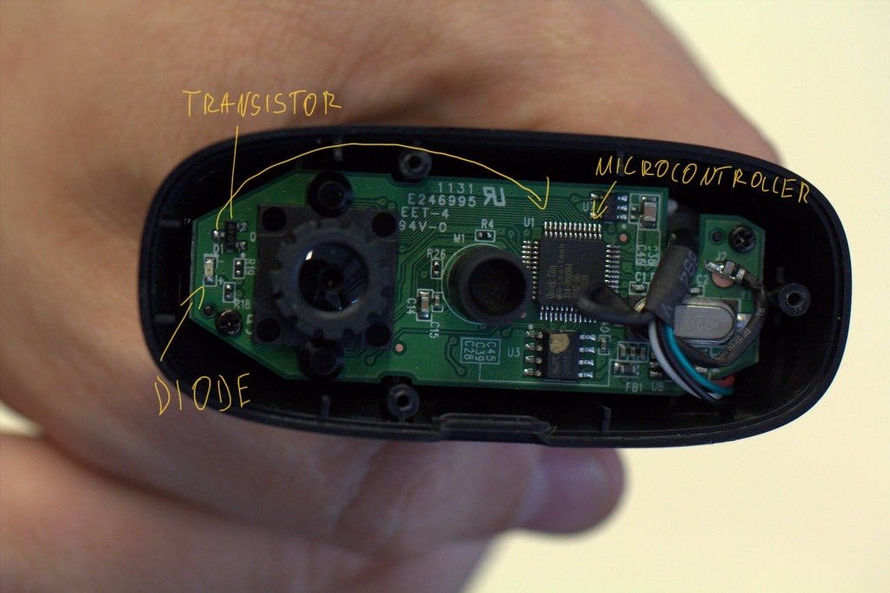

# Logitech C270

Analysis of the MacOs `LogitechWebcamComponent` Framework and WebCam Hardware.
The `LogitechWebcamComponent.framework` can be found in the "LogiCameraSettings_2.6.2.pkg" package or a in any other Logitech Webcam app for Mac, since it is the core lib for interacting with Logitech camera devices.
The disassembly was done with IDA Pro, the `libwebcamLib.dylib` can be found in `LogitechWebcamComponent.framework/Libraries/libwebcamLib.dylib`.

## `LogitechWebcamComponent` Analysis:  

### Functions/ Exports:
Here are the possible base namespace meanings for the export functions explained   

#### VCInterface_:
The video control interface resembles the standard Video Control Interface for basic configurations and oprerations with the camera.

#### ACL_ Interface: Bluetooth Protocol:

https://en.wikipedia.org/wiki/USB_video_device_class

ACL is part of the Bluetooth operations/ protocol stack and is exclusively used to transport data. The opposit to ACL is sco,which is mainly used for Voice Communication (or data and voice combined) and does not offer retransmissions.
It can be seen as the Video Control Interface for Bluetooth

The ACL_ methods provide basic operations to handle Bluetooth Device management and basic control commands

#### LAC_, LACCM_:

Depend on ACL flags and objects.  Offer methods for Bluetooth data and device management.

#### LVCMM_, LVC_, LVUVC_, LogiUVC_ Interface:

Logitech Video Control Manager, Logitech Video Controller, Logitech Video Universal USB Controller, Logitech USB Video Class

LVCMM_, LVC handle the basic device event management and video format, resolution configuration. LVUVC_ handles video device get/set methods.

The LogiUVC_ methods implement camera device discovery/ scanning.
The USB video device class (also USB video class or UVC) is a USB device class that describes devices capable of streaming video like webcams, digital camcorders, transcoders, analog video converters and still-image cameras.
The latest revision of the USB video class specification carries the version number 1.5 and was defined by the USB Implementers Forum in a set of documents describing both the basic protocol and the different payload formats

### Import functions:
Here are the possible base namespace meanings for the import functions explained  

#### IOKit, Core Media IO, Core Video Framework:

Logitech Core API implements methods from the IOKit Framework to manage low lvl communication with the webcam. To handle data streams and basic configuration apples CoreMediaIO (CM)Framework is use.
For further Video(data) stream operations Logitech utalizes Apples Core Video Framework (CV).

## Hardware:

The PCB of the webcam consists of 5 main components, which are the camera, the microphone, an IC, a quart and an eprom.
All of those main components are connected to the IC, the eprom is propably used as buffer for imgs and the quarts to clock the USB interface or synchronize video frame rate.  
The diode, responsible for the indication light is connected to ground via a transistor which is connecterd to an onboard IC.
The IC is most likely some kind of SoC, with a custom firmware, since there is a quarts which is most likely used for usb interface timing.

Also, there is a huge chunk of data in the `LogitechWebcamComponent` Framework, which could be the be firmware of the onboard IC (you can find a dump of the data in `possible_firmware.hex`). The data can indeed be disassembled with an AVR (Atmel) or x86 disassembler. Though it got to be said that it is far more likely to be an AVR architecture hence an Atmel chip. 

## **Possible** Indicator Light bypass

Since the indicator LED is more or less directly connected to the IC and their is no indication of direct LED control through the software drivers on the computer(the analysed Logi techWebcamComponent). It can only be assumed that the LED is controlled by the firmware on the onboard IC. If the found data chunk in `LogitechWebcamComponent` Framework was the firmware of the onboard IC, it would give us control over the IC, which would be a very powerfull attack vector since the IC controls the LED. (this possible issue requires further investigation.) 
In summary it can be assumed that, their is no obvious or easy to exploit issue in the software stack concept.
